<p align="center">
  
</p> Innovation Hub

Your project description goes here...
# 📊 BIH Data Analyst Journey

<p align="center">

**Learning by Doing • Building by Solving • Growing into a Data Analyst**

</p>

<p align="center">


</p>

---

# 📖 About

This repository documents my journey through the **Beacon Innovation Hub Data Analyst Pathway**.

The purpose of this repository is to document not only what I learn, but also **how I learn, how I apply concepts, the problems I solve, the mistakes I make, and how my analytical thinking develops over time.**

The pathway takes me from foundational data analysis toward the ability to independently work on an end-to-end data analytics project.

The core principle behind this repository is:

> **Don't just learn the tool. Learn how to use the tool to solve a problem.**

---

# 🎯 My Goal

My goal is to develop the skills required to become a **job-ready Junior Data Analyst**.

I want to be able to take a real-world organisational problem and move through the complete analytical process:

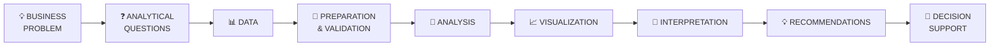

The objective is not simply to produce charts or SQL queries.

The objective is to turn **trustworthy data into useful information that can support better decisions.**

---

# 🧠 My Learning Philosophy

I am following a **learning-by-doing** approach.

I don't want to simply watch tutorials and copy what the instructor does.

Instead, I follow this process:

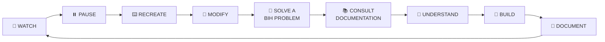

### My rule

**Watch it → Recreate it → Change it → Break it → Fix it → Apply it → Understand it → Document it.**

---

# 📚 BIH Data Analyst Pathway

My journey is organised into five levels.

```mermaid
flowchart TD

A["📊 BIH DATA ANALYST<br/>JOURNEY"]

A --> L1["📘 LEVEL 1<br/>Data Analytics Foundations"]

A --> L2["📗 LEVEL 2<br/>SQL & Statistical Analysis"]

A --> L3["📙 LEVEL 3<br/>Pathway Content<br/>To Be Added"]

A --> L4["📕 LEVEL 4<br/>Business Analytics &<br/>Communication"]

A --> L5["🏆 LEVEL 5<br/>Junior Data Analyst<br/>Readiness & Capstone"]

L1 --> L1A["Data Understanding"]
L1 --> L1B["Data Quality"]
L1 --> L1C["Exploratory Analysis"]
L1 --> L1D["Spreadsheet Analysis"]

L2 --> L2A["SQL"]
L2 --> L2B["Relational Data"]
L2 --> L2C["Statistics"]
L2 --> L2D["Analytical Reasoning"]

L3 --> L3A["Learning"]
L3 --> L3B["Practice"]
L3 --> L3C["Projects"]

L4 --> L4A["KPIs"]
L4 --> L4B["Dashboards"]
L4 --> L4C["Data Storytelling"]
L4 --> L4D["Management Communication"]

L5 --> L5A["Business Problem"]
L5 --> L5B["Data Preparation"]
L5 --> L5C["SQL & Statistics"]
L5 --> L5D["BI Report"]
L5 --> L5E["Findings & Recommendations"]
```

---

# 📘 Level 1 — Data Analytics Foundations

**Focus:** Building reliable analytical foundations.

The first level focuses on understanding how analysts frame questions, inspect data, identify quality problems, perform exploratory analysis, and use spreadsheets to produce reliable summaries.

### Key areas

* Business questions
* Data understanding
* Data quality
* Missing values
* Duplicate records
* Invalid data types
* Inconsistent categories
* Data cleaning
* Cleaning documentation
* Descriptive summaries
* Group comparisons
* Excel / spreadsheet analysis
* PivotTables
* PivotCharts
* Basic dashboards
* Evidence vs unsupported conclusions

### Analyst workflow

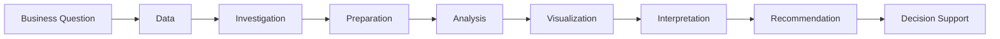

### Level 1 structure

```text
Level-1-Data-Analytics-Foundations/
│
├── datasets/
│   └── bih_data_analyst_practice.csv
│
├── excel/
│   └── level1_analysis.xlsx
│
├── analysis/
│   ├── data-understanding.md
│   ├── cleaning-log.md
│   └── findings.md
│
├── visuals/
│   ├── charts/
│   └── dashboards/
│
└── README.md
```

---

# 📗 Level 2 — SQL & Statistical Analysis

**Focus:** Moving from single-file analysis toward relational data and statistical reasoning.

### Key areas

* SQL fundamentals
* Filtering
* Aggregation
* `GROUP BY`
* `CASE`
* Joins
* Join validation
* Subqueries
* CTEs
* Window functions
* Descriptive statistics
* Distributions
* Skewness
* Outliers
* Covariance
* Correlation
* Population vs sample
* Sampling
* Sampling bias
* Confidence intervals
* Association vs causation
* Statistical reasoning

### Level 2 analytical workflow

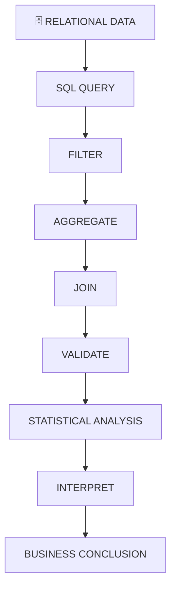

### Level 2 structure

```text
Level-2-SQL-Statistics/
│
├── datasets/
│
├── sql/
│   ├── basic-queries.sql
│   ├── aggregation.sql
│   ├── joins.sql
│   ├── join-validation.sql
│   └── advanced-analysis.sql
│
├── statistics/
│   ├── descriptive-statistics.md
│   ├── distributions.md
│   ├── correlation.md
│   └── sampling.md
│
├── exercises/
│
├── outputs/
│
└── README.md
```

---

# 📙 Level 3 — Data Analysis

> **Level 3 details will be documented here as I progress through the official BIH pathway content.**

### Planned repository area

```text
Level-3-Data-Analysis/
│
├── datasets/
│
├── notebooks/
│
├── analysis/
│
├── exercises/
│
├── outputs/
│
└── README.md
```

---

# 📕 Level 4 — Business Analytics & Communication

**Focus:** Converting technically correct analysis into useful management information.

At this stage, the focus moves beyond simply analysing data toward answering:

> **What does this information mean for the organisation?**

### Key areas

* Metrics
* KPIs
* Leading indicators
* Lagging indicators
* KPI formulas
* KPI limitations
* Visualization selection
* Dashboard hierarchy
* Dashboard design
* Pattern interpretation
* Uncertainty
* Evidence vs interpretation
* Recommendations
* Management briefs
* Data storytelling
* Communicating with non-technical stakeholders

### Data storytelling framework

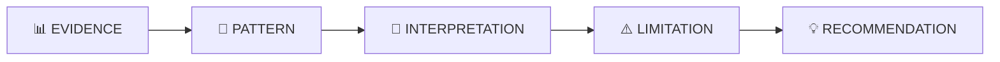

### KPI development

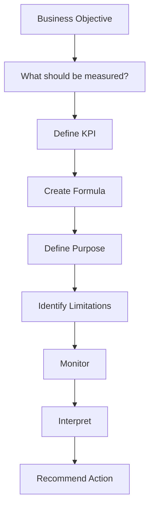

### Level 4 structure

```text
Level-4-Business-Analytics/
│
├── kpis/
│   ├── community-growth.md
│   ├── engagement.md
│   ├── skills-development.md
│   ├── project-participation.md
│   ├── project-completion.md
│   └── technical-performance.md
│
├── dashboards/
│   └── BIH-dashboard/
│
├── reports/
│   └── management-brief.md
│
├── storytelling/
│   └── findings.md
│
└── README.md
```

---

# 🏆 Level 5 — Junior Data Analyst Readiness & Capstone

**Focus:** Demonstrating independent, end-to-end data analyst competence.

The final stage brings together the skills developed throughout the pathway.

### End-to-end process

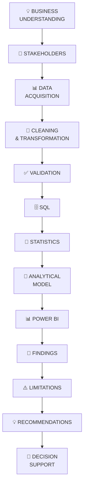

---

# 🏢 BIH Community Performance Analysis

### Capstone Business Question

> **How effectively is Beacon Innovation Hub engaging participants, developing technical skills, and supporting project activity?**

The capstone will bring together:

* Business understanding
* Data preparation
* Data validation
* SQL
* Statistics
* Data modelling
* Power BI
* KPIs
* Findings
* Recommendations
* Professional communication

---

## 📊 Capstone Dashboard

The final Power BI report will be organised around decision-focused pages.

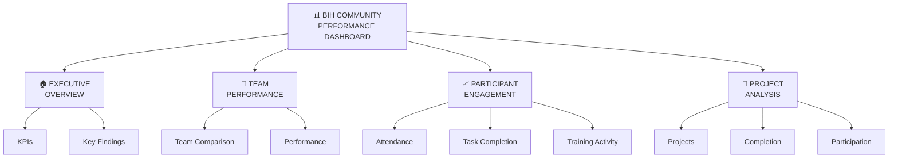

---

# 📁 Complete Repository Structure

The complete repository will follow this structure:

```text
BIH-Data-Analyst-Journey/
│
├── 📘 Level-1-Data-Analytics-Foundations/
│   │
│   ├── datasets/
│   │   └── bih_data_analyst_practice.csv
│   │
│   ├── excel/
│   │   └── level1_analysis.xlsx
│   │
│   ├── analysis/
│   │   ├── data-understanding.md
│   │   ├── cleaning-log.md
│   │   └── findings.md
│   │
│   ├── visuals/
│   │   ├── charts/
│   │   └── dashboards/
│   │
│   └── README.md
│
├── 📗 Level-2-SQL-Statistics/
│   │
│   ├── datasets/
│   │
│   ├── sql/
│   │   ├── basic-queries.sql
│   │   ├── filtering.sql
│   │   ├── aggregation.sql
│   │   ├── joins.sql
│   │   ├── join-validation.sql
│   │   └── advanced-analysis.sql
│   │
│   ├── statistics/
│   │   ├── descriptive-statistics.md
│   │   ├── distributions.md
│   │   ├── correlation.md
│   │   └── sampling.md
│   │
│   ├── exercises/
│   │
│   ├── outputs/
│   │
│   └── README.md
│
├── 📙 Level-3-Data-Analysis/
│   │
│   ├── datasets/
│   ├── notebooks/
│   ├── analysis/
│   ├── exercises/
│   ├── outputs/
│   └── README.md
│
├── 📕 Level-4-Business-Analytics/
│   │
│   ├── kpis/
│   ├── dashboards/
│   ├── reports/
│   ├── storytelling/
│   ├── exercises/
│   └── README.md
│
├── 🏆 Level-5-Capstone/
│   │
│   ├── data/
│   │   ├── raw/
│   │   └── cleaned/
│   │
│   ├── sql/
│   │   └── analysis.sql
│   │
│   ├── notebooks/
│   │   └── analysis.ipynb
│   │
│   ├── power-bi/
│   │   └── BIH-dashboard.pbix
│   │
│   ├── outputs/
│   │   ├── charts/
│   │   └── reports/
│   │
│   ├── findings/
│   │   └── findings.md
│   │
│   ├── recommendations/
│   │   └── recommendations.md
│   │
│   └── README.md
│
├── 🖼️ assets/
│   ├── images/
│   ├── screenshots/
│   └── diagrams/
│
└── 📄 README.md
```

---

# 🗺️ Repository Architecture

The entire repository can be viewed as:

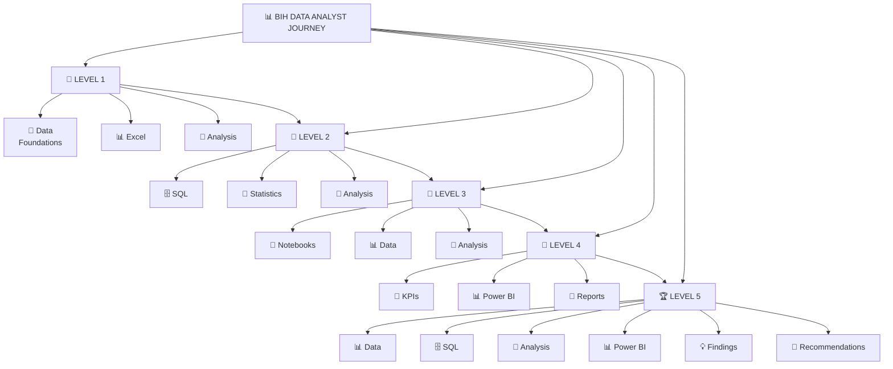

---

# 🛠️ Tools & Technologies

| Category                  | Tools                                  |
| ------------------------- | -------------------------------------- |
| Programming               | Python                                 |
| Data Analysis             | Pandas, NumPy                          |
| Interactive Analysis      | Jupyter Notebook                       |
| Databases                 | SQL, PostgreSQL / relational databases |
| Spreadsheets              | Microsoft Excel                        |
| Visualization             | Power BI                               |
| Business Analytics        | KPIs, Metrics, Data Storytelling       |
| Data Engineering Concepts | ETL, Data Pipelines                    |
| Version Control           | Git                                    |
| Repository                | GitHub                                 |

---

# 📊 What I Aim to Produce

Throughout this journey, I will build and document:

* 📓 Jupyter notebooks
* 🧹 Data-cleaning workflows
* 🗄️ SQL queries
* 📐 Statistical analyses
* 📊 Excel analyses
* 📈 Power BI dashboards
* 🎯 KPI frameworks
* 📝 Management briefs
* 💡 Business recommendations
* 🏆 End-to-end analytics projects

---

# 🔬 How I Document My Analysis

For major projects, I will follow:

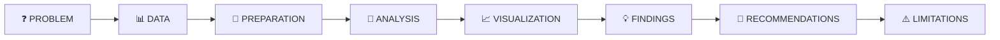

Every major project should answer:

### 1. What problem am I solving?

### 2. What data am I using?

### 3. How did I prepare the data?

### 4. What analysis did I perform?

### 5. What did I discover?

### 6. Why does it matter?

### 7. What should decision-makers consider doing?

### 8. What are the limitations of the analysis?

---

# 🚦 Evidence Framework

I will distinguish between three different types of statements:

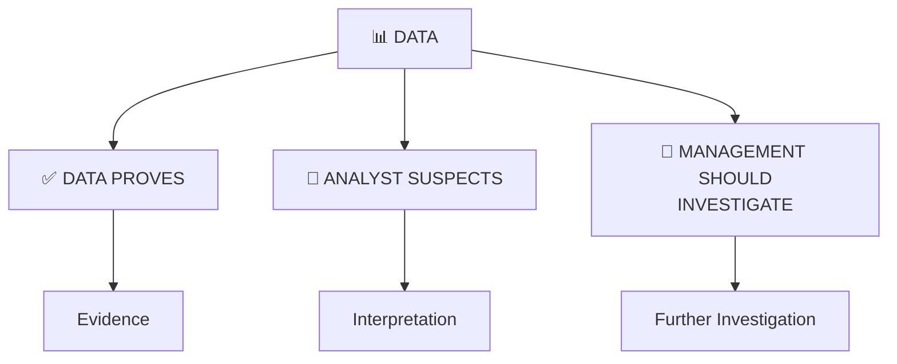

This helps prevent the common mistake of presenting assumptions or correlations as proven facts.

---

# 📈 Progress Tracker

## Foundation

* [ ] Level 1 — Data Analytics Foundations
* [ ] Level 2 — SQL & Statistical Analysis

## Development

* [ ] Level 3 — Data Analysis
* [ ] Level 4 — Business Analytics & Communication

## Professional Readiness

* [ ] Level 5 — Junior Data Analyst Capstone

---

# 🏆 Final Competency Goal

By the end of this journey, I want to be able to independently:

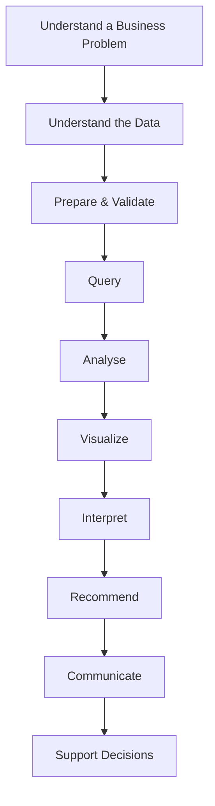

---

# 💭 Lessons & Reflections

This section will grow throughout the journey.

I will document:

* What I learned
* What confused me
* Mistakes I made
* Problems I solved
* New techniques discovered
* Documentation I consulted
* What I would do differently
* How my analytical thinking is developing

---

# 🚀 Journey Principle

> **Learn → Build → Experiment → Solve → Understand → Document → Repeat**

This repository is more than a collection of exercises.

It is a record of my development from **learning data analysis concepts to applying them to real analytical problems**.

---

<p align="center">

### 📊 From Data → Information → Insight → Decision

**BIH Data Analyst Journey**

</p>

